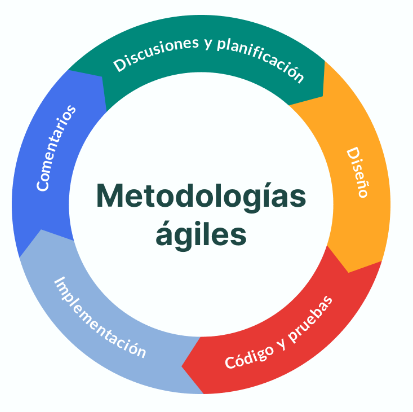
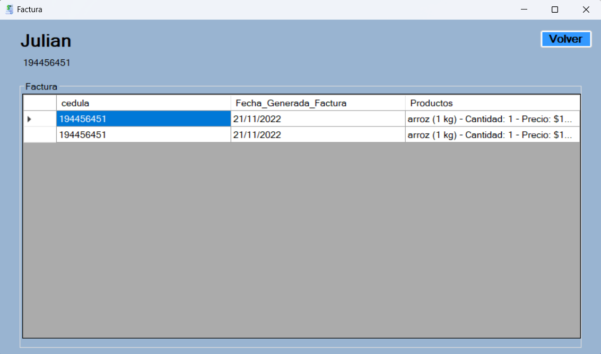

<h1 align="center">Proyecto Final Base de datos</h1>
<h2 align="center"> Ambiance SuperMarket </h2>
<h3 align="center"> Programa hecho para el control y registro de inventario de un supermercado</h3>
 Presentado por por: 
    Daniel Alfonso Peña Quintero - Andrés Camilo Parra Godoy
    
# Tabla de Contenidos
[1. Introducción](#introducción)

[2. Herramientas usadas para la solución](#herramientas-usadas-para-la-solución)

[3. Necesidad](#necesidad)

[4. Diseño de interfaz](#diseño-de-interfaz)

[5. MER](#mer)

[6. Arquitectura de software](#arquitectura-de-software)

[7. Metología usada](#metodologia-usada)

[8. Desarrollo Proyecto](#Desarrollo-Proyecto)

[9. Conclusiones](#Conclusiones)

# Introducción
Para un supermercado es crucial llevar un control de lo que se tiene en bodega para poder vender correctamente sus productos a los clientes. 

Para este supermercado se tiene una aplicación que cuenta con un 'Login' para que los roles de administrador puedan ver, modificar, añadir y eliminar productos según corresponda. Sin embargo, hay otra opción de ingresar como invitado y solo visualizar los productos que existan en stock. Al final de cada uno de estos se podrá generar una factura en caso de que el usuario desee ver los productos que quiera adquirir.

# Herramientas usadas para la solución
<h2>C#</h2>
Se utilizó el lenguaje de programación C# porque es uno de los más compatibles con Visual Studio. Las principales ventajas que presenta el uso C# en comparación con otros lenguajes es su potencia como lenguaje, pero también su flexibilidad.

<h2> Visual Studio </h2> 

Se usó la herramienta de texto Visual Studio que facilita la creación de formularios e interfaces gráficas para luego realizar el código de acuerdo a las especificaciones del proyecto

 

<h2> Microsoft SQL server Management Studio </h2> 

Como servidor de bases de datos se tiene Microsoft SQL server, el cual permite almacenar información en bases de datos y realizar la conexión directa con Visual Studio.

# Necesidad

El proyecto se crea a partir de la necesidad de tener un control de gestión de inventarios para poder manejar el stock de los diferentes productos además de generar una serie de facturas que facilitaran las operaciones de logística y facturación del supermercado.

# Interfaz gráfica

La interfaz inicia con un login de usuario y contraseña para poder ingresar al menú principal y solo los usuarios que esten registrados van a poder añadir, modificar y eliminar los productos.

En caso de que el usuario ingrese como invitado logrará navegar por el inventario y podrá buscar los productos para ver la información de cada uno, sin embargo, no tendrá permiso de insertar, eliminar o modificar ningún producto del supermercado.

# MER

El modelo entidad-relación del proyecto se muestra a continuación:

# Arquitectura de Software

Se utilizó la arquitectura de software en 3 capas. Este con el fín de separar las aplicacipnes en 3 niveles de forma lógica y física. Es una arquitectura ideal para aplicaciones cliente-servidor tradicionales

<h2>Capa Logica</h2>
En esta capa encontramos las columnas de la tabla producto para poder utilizar estos datos en la capa datos.

<h2>Capa Datos</h2>
En esta capa encontramos los procedimientos almacenados que se van a utilizar en la capa de negocios.Esta capa cuenta con una referencia a la clase lógica

<h2>Capa Presentacion</h2>
La capa de presentación es la que ve el usuario , presenta el sistema al usuario, le comunica la información y captura la información del usuario en un mínimo proceso.

# Metodología Ágil

El proyecto utilizará la metodología ágil, ya que con estos métodos es posible adaptar los estilos de trabajo y las condiciones del proyecto, utilizar métodos flexibles para realizar mejoras y aumentar la satisfacción del cliente. A continuación, se mencionarán algunas características de la metodología ágil:

• Es util para proyectos pequeños de poco riesgo.  
• Mínima cantidad de reglas y documentación.  
• Participación continua de los evaluadores.  
• Es fácil incorporar cambios en el producto.  
• Depende en gran medida de la interacción de las partes interesadas. 
• Fácil de gestionar.  
• Entrega anticipada de soluciones parciales.  
• Mejora continua del proceso integrada.  

# Desarrollo Proyecto

### Inicio Invitado

En el inicio de sesión como invitado se muestra como se deshabilitan algunos botones debido a los permisos del usuario.

### Acceso Satisfactorio

Cuando se ingresa un usuario adecuado se muestra el nombre del usuario en la parte superior junto con todos los botones habilitados

### Inicio Admin

Cuando se inicia sesión como administrador el usuario cuenta con todos los botones habilitados 

### Búsqueda Admin

Se puede observar como busca los productos por coincidencia en el valor ingresado

Al final se puede generar una factura con el nombre del cliente y su cédula mostrando en una tabla los productos que se desean agregar a la factura.

### Conclusiones 

Gracias al programa desarrollado se llegó a las siguientes conclusiones: 
•	La arquitectura de 3 capas facilita el diseño y desarrollo de programas cliente-servidor.  
•	El uso de bases de datos contribuye al business intelligence  
•	Visual estudio facilita la creación de aplicaciones de escritorio  

