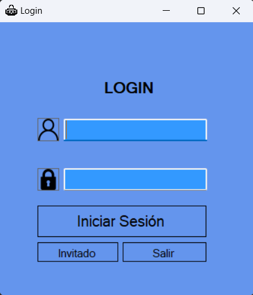
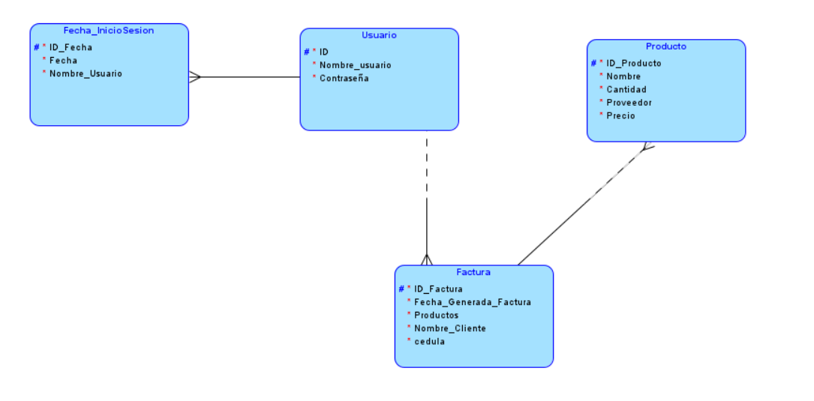

<h1 align="center">Proyecto Final Base de datos</h1>
<h2 align="center"> Ambiance SuperMarket </h2>
<h3 align="center"> Programa hecho para el control y registro de inventario de un supermercado</h3>
 Presentado por por: 
    Daniel Alfonso Peña Quintero - Andrés Camilo Parra Godoy
    
# Tabla de Contenidos
[1. Introducción](#introducción)

[2. Herramientas usadas para la solución](#herramientas-usadas-para-la-solución)

[3. Necesidad](#necesidad)

[4. Diseño de interfaz](#diseño-de-interfaz)

[5. MER](#mer)

[6. Arquitectura de software](#arquitectura-de-software)

[7. Metología usada](#metodologia-usada)

[8.Desarrollo Proyecto](#Desarrollo-Proyecto)

# Introducción
Para un supermercado es crucial llevar un control de lo que se tiene en bodega para poder vender correctamente sus productos a los clientes. 

Para este supermercado se tiene una aplicación que cuenta con un 'Login' para que los roles de administrador puedan ver, modificar, añadir y eliminar productos según corresponda. Sin embargo, hay otra opción de ingresar como invitado y solo visualizar los productos que existan en stock. Al final de cada uno de estos se podrá generar una factura en caso de que el usuario desee ver los productos que quiera adquirir.

# Herramientas usadas para la solución
<h2>C#</h2>
Se utilizó el lenguaje de programación C# porque es uno de los más compatibles con Visual Studio. Las principales ventajas que presenta el uso C# en comparación con otros lenguajes es su potencia como lenguaje, pero también su flexibilidad.

<h2> Visual Studio </h2> 

Se usó la herramienta de texto Visual Studio que facilita la creación de formularios e interfaces gráficas para luego realizar el código de acuerdo a las especificaciones del proyecto

 

<h2> Microsoft SQL server Management Studio </h2> 

Como servidor de bases de datos se tiene Microsoft SQL server, el cual permite almacenar información en bases de datos y realizar la conexión directa con Visual Studio.

# Necesidad

??

# Interfaz gráfica

La interfaz inicia con un login de usuario y contraseña para poder ingresar al menú principal y solo los usuarios que esten registrados van a poder añadir, modificar y eliminar los productos.

En caso de que el usuario ingrese como invitado logrará navegar por el inventario y podrá buscar los productos para ver la información de cada uno, sin embargo, no tendrá permiso de insertar, eliminar o modificar ningún producto del supermercado.

???

# MER

El modelo entidad-relación del proyecto se muestra a continuación:

# Arquitectura de Software

??

# Metodología Ágil

El proyecto se realizará en base a una metodología ágil debido a que gracias a estas metodologías se logra adaptar a la forma de trabajo y a las condiciones del proyecto,utilizando enfoques flexibles para ofrecer mejoras y aumentar la satisfacción del cliente. Es por esto, que se decidió utilizar la metodología SCRUM.
La metodología SCRUM se utilizó debido a sus ventajas, las cuales son: innovación, flexibilidad, competitividad y productividad.
La metodología SCRUM se compone de diferentes etapas. 
- La primer etapa es de suma importancia debido a que se crea la visión del proyecto y el plan de lanzamiento.
- La segunda etapa es la de planificación y estimación donde se elaboran y se definen las primeras tareas y se aceptan sugerencias y optimizaciones del proceso
- La tercer etapa es la implementación donde se crean los primeros entregables diseñando la aplicación junto con las optimizaciones del cliente
- La cuarta etapa es la revisión e retroespectiva donde se construye y se implementa el programa realizando demostraciones y validaciones del mismo
- La quinta y última etapa es el lanzamiento donde se envían los entregables y se hace la respectiva evaluación y monitoreo del proyecto

# Desarrollo Proyecto

### A continuación se expondrá el desarrollo y la demostración del proyecto:

???

### Inicio Invitado

??

En dado caso que ya se dese iniciar sesión, en cada una de las pestañas mencionadas anteriormente hay un botón de inicio de sesión, y una vez presionado, redirige al usuario a hacer login, en caso que el usuario acceda con credenciales en las bases de datos el programa le mostrará una alerta de ingreso satisfactorio, y en caso de que el usuario ingrese credenciales que no se encuentren en la base de datos se negará el acceso. 

### Acceso Satisfactorio

???

Una vez que el usuario ingrese este logrará ver las diferentes opciones para modificar el inventario de laboratorio, cada una de las pestañas dejará al usuario autorizado insertar, eliminar o modificar un dato de una manera eficiente como se demuestra a continuación

### Inicio Admin

??

Además si el usuario desea buscar un archivo una vez que ingrese a la pestaña de buscar esta lo redirigirá a la ventana de busqueda la cual es la misma que la de busqueda de invitado, sin embargo, si se ingresa a esta ventana una vez ya se ha iniciado sesión el programa ya no le dirá al usuario que inicie sesión sino le mostrará un botón de volver para que el usuario pueda volver a la ventana de modificación inmediatamente

### Búsqueda Admin

Finalmente tanto para vista invitado como para la vista de Admin la última pestaña que se verá en el programa es la venta autor, donde se verán los respectivos créditos y detalles de quien realizó el proyecto

### Conclusiones 

Debido a la necesidad de un sistema de control eficiente para la gestión de la información en los laboratorios químicos, se realizó un programa el cual disminuya la deficiencia a la hora de buscar, insertar, modificar datos de los diferentes laboratorios. Gracias al programa desarrollado se concretaron las siguientes conclusiones: 
•	??  
•	??  
•	??  

